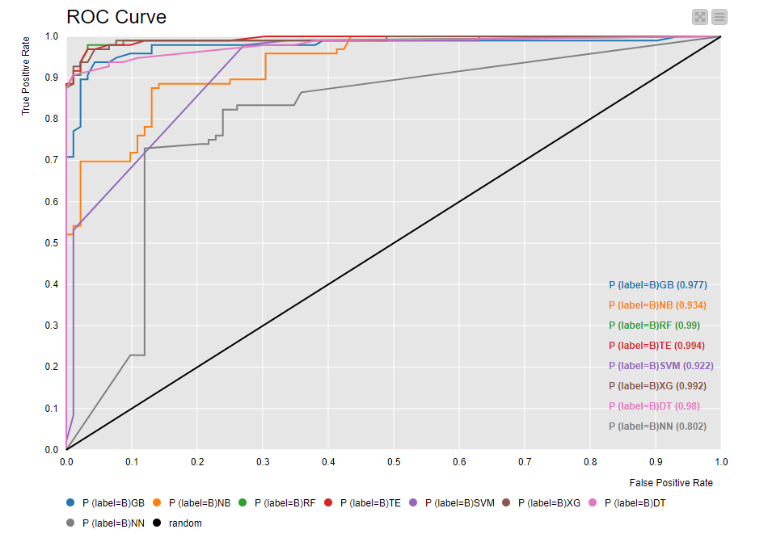

# RDPM
Ransomware Detection Using Process Memory

# Files
- Benign.db -> Contains all the benign records sourced mostly from portable apps

- Ransomware.db -> Contains all the ransomware records sourced from Malware Bazaar (abuse.ch)

- XGBoostTrainingOutputData.xlsx -> Output data from the best performing Machine Learning algorithm

- extraction.py -> Script to parse the cuckoo reports to build the DBs

- features.xlsx -> The dataset itself

# Accuracy

| TECHNIQUE    | Decision Tree | Tree Ensemble | Random Forest | Naive Bayes | XGBoost   | Gradient Boosted Tree | Support Vector Machine | Neural Network |
| ------------ | ------------- | ------------- | ------------- | ----------- | --------- | --------------------- | ---------------------- | -------------- |
| Accuracy (%) | 93.62         | 95.74         | 95.21         | 81.38       | **96.28** | 94.68                 | 85.64                  | 93.62          |

# ROC
 

